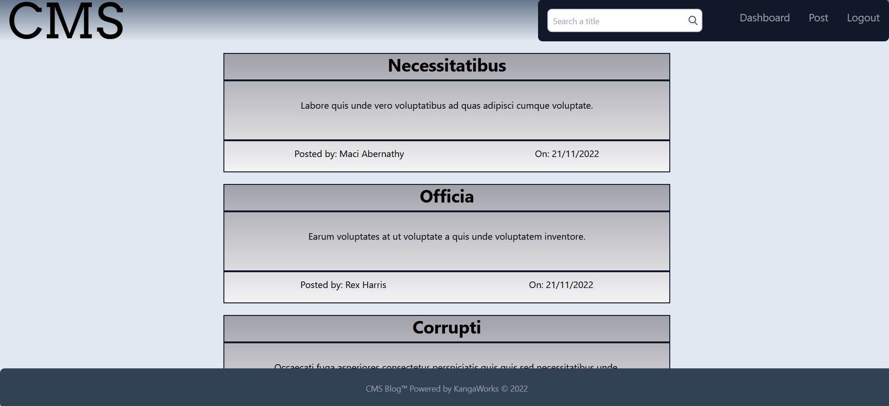
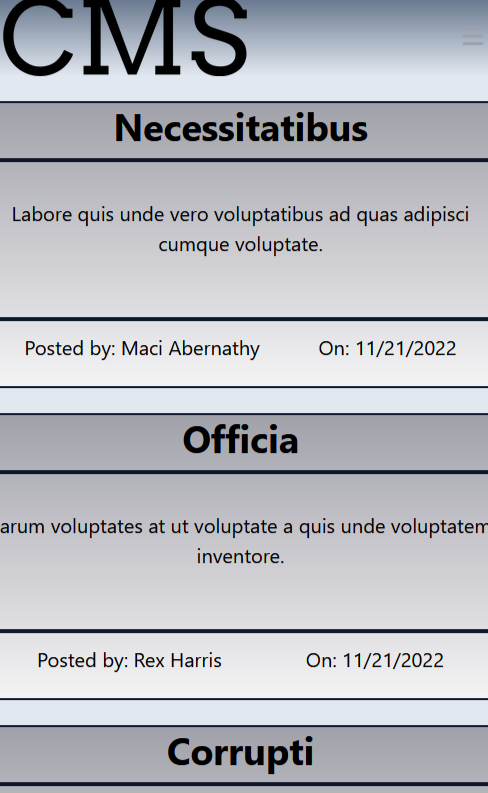

# <CMS-Blog>
## CMS Blog
<a id="readme-top"></a>

<!-- TABLE OF CONTENTS -->
<details>
  <summary>Table of Contents</summary>
  <ol>
    <li><a href="#description">Description</a></li>
    <li><a href="#installation">Installation</a></li>
    <li><a href="#issues">Issues</a></li>
    <!-- <li><a href="#usage">Usage</a></li> -->
    <li><a href="#license">License</a></li>
    <li><a href="#contact">Contact</a></li>
    <li><a href="#acknowledgments">Acknowledgments</a></li>
  </ol>
</details>

<!-- ABOUT THE PROJECT -->
## Description
<details> <summary>Desktop View</summary>



</details>

<details><summary>Mobile View</summary>

<p align="center">

</p>

</details>

**What**

CMS Blog is a website for all your coding tips posted by the community. Anyone is free to add their own tips about coding and view them as well!

**Notable Technologies used**
- Javascript
- Node js
- Sequelize
- Express
- Tailwind (+ flowbite)
- Faker-js

All NPMs and dependencies can be found in the [package.json](./package.json) under <strong>dependencies</strong> & <strong>devDependencies</strong>

**Acquired Knowledge**

Throughout this mini-project, I have mainly strengthen my understanding of making a full-stack web-application using the [MVC](https://developer.mozilla.org/en-US/docs/Glossary/MVC) (Models, Views, Controllers) software architectural pattern/design.

There has also been a better understanding of <strong>Handlebarsjs</strong> from the various errors I have encountered. There can be viewed on the [views](./views/) folder under comments placed across the handlebars' files.

<p align="right">(<a href="#readme-top">back to top</a>)</p>

<!--INSTALLATION-->
## Installation:
Initialization 
```
npm i 
npm run seed
npm start 
```
<p align="right">(<a href="#readme-top">back to top</a>)</p>

## Issues

These are some highlighted issues with the current build:

1. Upon login or signup, the User is direct to the homepage, however the navbar does not render the apprioriate links(Dashboard, Logout). This can only be solved by refreshing the page again for the apprioriate links on the navbar to appear.

2. On dashboards, any User can view another's User's posts. However the issue is that the edit and delete button shows for all users. In Handlebarsjs, the helper function: {{#forEach value |as| valueName}} only allows ```valueName.properties``` to be called until the end of the function(eg. {{/forEach}}). This has prevent me in putting a ```req.session.property``` to only show these buttons to the actual User only. Currently this is solved by, making the update & delete buttons to not work for other users; authorising exist on the backend. 

3. The delete button will show a confirm prompt upon clicking, however if other post's delete button is clicked while the prompt is still rendering, and the confirm prompt is confirmed, delete will cascade to those posts as well. Currently this is solved by, adding the ```display:none```to all elements except the confirm prompt to prevent clicked other delete buttons, and ```document.location.reload()``` upon clicking either prompts(eg. Yes or No).

4. The search bar on the navbar does not currently have any function.


<p align="right">(<a href="#readme-top">back to top</a>)</p>

<!-- LICENSE -->
## License
This is distributed under the MIT License. See [LICENSE.txt](./LICENSE) for more information.

<p align="right">(<a href="#readme-top">back to top</a>)</p>

<!-- CONTACT -->
## Contact

Samuel Wai Weng Yong - <a href="mailto:samuelyongw@gmail.com"> samuelyongw@gmail.com </a>

Github Link: [KangaZero](https://github.com/KangaZero)

Repo Link: [Employee-Tracker-CMS](https://github.com/KangaZero/Employee-Tracker-CMS)

Website Link: https://kangacmsblog.herokuapp.com/

<p align="right">(<a href="#readme-top">back to top</a>)</p>
 
## Acknowledgments

Here are some of the resources used as reference to build this personal portfolio:

* [Faker](https://fakerjs.dev/guide/)
* [Mozilla doc](https://developer.mozilla.org/en-US/)
* [flowbite](https://flowbite.com/docs/getting-started/introduction/)
* [Deployment on Heroku](https://coding-boot-camp.github.io/full-stack/heroku/deploy-with-heroku-and-mysql)


**Extra**
 
In additional the the linked learning resources, I would like to acknowledge the following person(s):
* Matthew D. Jusuf: [Github](https://github.com/mecuboi)
   - Aided in debugging an error for heroku deployment. 
        A small error where some files named uppercased on the github repo, but not on the local machine, resulting in missing modules.

<p align="right">(<a href="#readme-top">back to top</a>)</p>


<p align="center">Thanks for reading this! 😄</p>